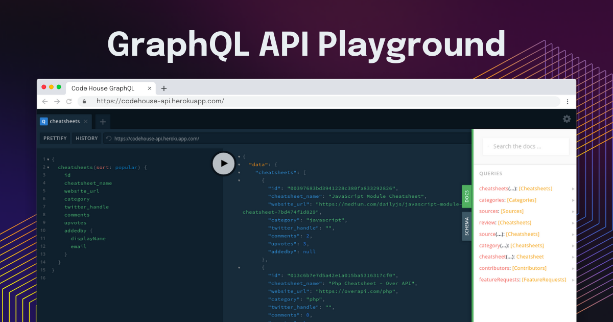

# API Usage



We have built a super simple, easy to user, GraphQl API playground for you to test and make your own app with our API. API is available at [https://codehouse-api.herokuapp.com/](https://codehouse-api.herokuapp.com/)

Here is how you can use Graphql with `fetch`, feel free to use any of your types, axios, jquery etc.

## Example Code with `Fetch`

```js
fetch("https://codehouse-api.herokuapp.com/", {
  method: "POST",
  body: JSON.stringify({query: "{
    cheatsheets(sort: popular){
      cheatsheet_name
      website_url
    }
  }"}),
}).then((response)=> {
  console.log(response.data)
}).catch((error)=> {
  error.message
})
```

Here are some examples for you to get started ✌️

- [Get Top Cheatsheets](#user-content-get-top-cheatsheets)
- [Get Latest Cheatsheets](#user-content-get-latest-cheatsheets)
- [Get All Categories](#user-content-get-all-categories)
- [Get All Cheatsheets of a Category](#user-content-get-all-cheatsheets-of-a-category)
- [Get All Sources](#user-content-get-all-sources)
- [Get All Cheatsheets from a Source](#user-content-get-all-cheatsheets-from-a-source)
- [Get All Cheatsheets on Review](#user-content-get-all-cheatsheets-on-review)
- [Get Contents of a particular Cheatsheet](#user-content-get-contents-of-a-particular-cheatsheet)
- [Get All Contributors](#user-content-get-all-contributors)
- [Get All Feature Requests](#user-content-get-all-feature-requests)

---

### Get Top Cheatsheets

```
{
  cheatsheets(sort: popular){
    cheatsheet_name
    website_url
  }
}
```

### Get Latest Cheatsheets

```
{
  cheatsheets(sort: newest){
    cheatsheet_name
    website_url
  }
}
```

### Get All Categories

```
{
  categories{
    id
    name
  }
}
```

### Get Cheatsheets of a Category

```
{
  category(name: "html"){
    cheatsheet_name
    website_url
  }
}
```

### Get All Sources

```
{
  sources{
    hostname
    cheatsheets_count
  }
}
```

### Get Cheatsheets from a Source

```
{
  source(from: "medium.com"){
    cheatsheet_name
    upvotes
  }
}
```

### Get All Cheatsheets on Review

```
{
  review{
    cheatsheet_name
    website_url
  }
}
```

### Get Contents of a particular Cheatsheet

```
{
  cheatsheet(id: "63971e87ed4f4deb89e7777d2b3a6862") {
    cheatsheet_name
    description
    cover_image
  }
}
```

### Get All Contributors

```
{
  contributors {
    displayName
    email
    photoURL
  }
}

```

### Get All Feature Requests

```
{
  featureRequests {
    title
    description
    upvotes
  }
}
```
