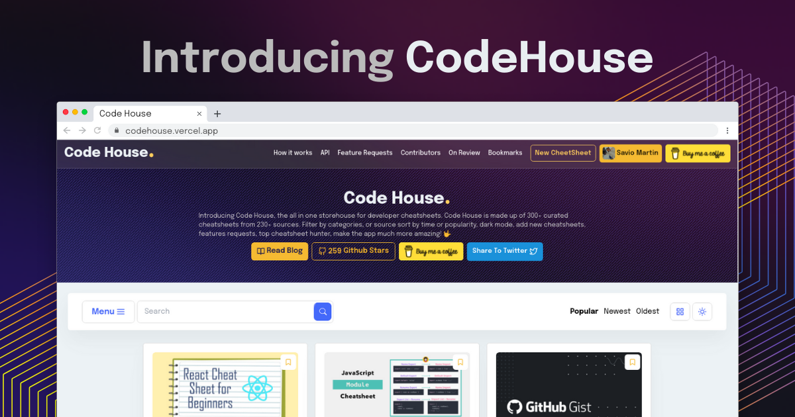

<p align="center">
  <a href="https://codehouse.vercel.app/">
    
  </a>
</p>
<h2 align="center">Code House</h1>
<h4 align="center">Store House of 300+ Developer cheatsheets✨️</h4>

<p align="center">
<a href="https://github.com/saviomartin/codehouse/blob/master/LICENSE" target="blank">

</a>
<a href="https://github.com/saviomartin/codehouse/fork" target="blank">

</a>
<a href="https://github.com/saviomartin/codehouse/stargazers" target="blank">

</a>
<a href="https://github.com/saviomartin/codehouse/issues" target="blank">

</a>
<a href="https://github.com/saviomartin/codehouse/pulls" target="blank">

</a>
<a href="https://twitter.com/intent/tweet?text=Checkout%20codehouse.vercel.app%20by%20@SavioMartin7%0A%0AMore%20than%20300%20developer%20cheatsheets%20all%20in%20one%20place,%20with%20more%20amazing%20features.%20You%27ll%20love%20it!%F0%9F%94%A5%0A%0A%23DEVCommunity"></a>

</p>

<p align="center"></p>

<p align="center">
    <a href="https://codehouse.vercel.app/" target="blank">View Demo</a>
    ·
    <a href="https://github.com/saviomartin/codehouse/issues/new/choose">Report Bug</a>
    ·
    <a href="https://github.com/saviomartin/codehouse/issues/new/choose">Request Feature</a>
</p>

### Introducing Code House ✌️

Code House is the all in one storehouse for developer cheatsheets. Code House is made up of 300+ curated cheatsheets from 230+ sources. Filter by categories, or source, sort by time or popularity, dark mode, bookmark cheatsheets, add new cheatsheets, request feature, and much more features, make the app amazing! 🤟

[Read blog to understand better 📖](https://savio.xyz/)

## 🚀 Demo

<a href="https://codehouse.vercel.app/" target="blank">

</a>

Try the App: [Code House](https://codehouse.vercel.app/)

## 🧐 Features

Code House comes up with a whole bunch of amazing features to provide you the best experience, Here're some of our best features.

> I recommend you to bookmark code house, because it will become super handy one day!

- 💯 **300+ Cheatsheets**
- 🎩 **Filter by Category** (27 Cateogries)
- 👾 **Filter By Source** (220+ Sources)
- 🔖 **Bookmark Cheatsheets**
- 📦 **Add new Cheatsheet** (on browser itself)
- 🍭 **Seperate page for each Cheatsheet**
- 🌱 **Request for Features**
- 🥁 **API Support** [>> API Usage](API-usage.md)
- 🧐 **Report Cheatsheet**
- 🕊️ **GraphQL Playground**
- 👨‍💻 **Contributors Page**[ >>Contributing](#-contributing)
- 🕒 **Sort by time or popularity**
- 🔎 **Search Filter**
- 🗃️ **Toggle View** (List View or Grid View)
- 🌘 **Dark mode**
- 🔺 **Upvote/Comment on Cheatsheets**
- 📬 **Newsletter** (once a week)
- 💻 **Fully Responsive**

Code House is the next revelutionary app to hunt the best cheatsheets for all types ✨️

## 🛠️ Installation Steps

1. Clone the repository

```bash
git clone https://github.com/saviomartin/codehouse.git
```

2. Change the working directory

```bash
cd codehouse
```

3. Install dependencies

```bash
npm install
```

4. Create `.env` file in root and add your variables

```bash
NEXT_PUBLIC_DB_URL= YOUR_HARPER_DB_DATABASE_URL
NEXT_PUBLIC_DB_AUTHORIZATION= YOUR_HARPER_DB_AUTHORIZATION_ID
```

5. Run the app

```bash
npm run dev
```

You are all set! Open [localhost:3000](http://localhost:3000/) to see the app.

## 🍰 Contributing

Pull Requests are always welcome! You can add a cheatsheet on the browser (Anonymously or Singed In). Your cheatsheet will be reviewed and added to the app, also see yourself in contributors.

If you wish to contribute using Github, you can work on any features [codehouse.vercel.app/feature-requests](https://codehouse.vercel.app/feature-requests) or create one on your own. After adding your code, send us a Pull Request.

After your PR got merged, you'll be automatically appared on [contributors page](https://codehouse.vercel.app/contributors). Works through Github API.

- Please contribute using [GitHub Flow](https://guides.github.com/introduction/flow). Create a branch, add commits, and [open a pull request](https://github.com/saviomartin/codehouse/compare).

- Please read [`CONTRIBUTING`](CONTRIBUTING.md) for details on our [`CODE OF CONDUCT`](CODE_OF_CONDUCT.md), and the process for submitting pull requests to us.

## 💻 Built with

- [Next JS](https://nextjs.org/)
- [Harper DB](https://harperdb.io/): source for complete database
- [lodash](https://lodash.com/): for some functions
- [CORS](https://www.npmjs.com/package/cors): for CORS support
- [uuid](https://www.npmjs.com/package/uuid): for generating uuids
- [react-icons](https://react-icons.github.io/react-icons/): for icons
- [react-infinite-scroll-component](https://github.com/ankeetmaini/react-infinite-scroll-component): for infinite scrolling
- [react-ripples](https://github.com/rwu823/react-ripples): for ripple effects
- [nprogress](https://www.npmjs.com/package/nprogress): for slim progressbars
- [parallax-js](http://matthew.wagerfield.com/parallax/): for parallax effects
- [react-hot-toast](https://react-hot-toast.com/): for toasts
- [firebase](https://firebase.google.com/): for authentication
- [date-fns](https://date-fns.org/): for formatting dates
- [Material UI](http://material-ui.com/): for components
- [Animate.css](https://animate.style/): for smooth Animations
- [AOS](https://michalsnik.github.io/aos/): for scroll animations
- [react-router-dom](https://reactrouter.com/web/guides/quick-start): for routing
- [AWS Amplify](https://aws.amazon.com/amplify/): for hosting

## 🌈 What's next

Code House is the biggest ever project I have made till date, I have a big idea in my mind, and you can see a lot more features coming soon.

Here are some idea that is coming really soon 👀

- Profile Page
- PWA, **In Progress ⏳️**
- Reply to a comment
- Markdown support for feature requests
- Twitter and Facebook Auth, **In Progress ⏳️**
- Perform Operations with API
- Create Collection when bookmarking cheatsheets
- Featuring Cheatsheets on day basis
- Generate Cover Image for missing ones
- Settings page
- Choose Secondary color
- Pin a cheatsheets to the top
- Hear description for posts, **In Progress ⏳️**

## 🛡️ License

This project is licensed under the MIT License - see the [`LICENSE`](LICENSE) file for details.

## 🦄 Deploy

<a href="https://vercel.com/new/project?template=https://github.com/saviomartin/codehouse">

</a>
<a href="https://app.netlify.com/start/deploy?repository=https://github.com/saviomartin/codehouse">

</a>
<a href="https://cloud.digitalocean.com/apps/new?repo=https://github.com/saviomartin/codehouse">

</a>

## 👨‍💻 Thanks to the all Contributors

Thanks a lot for spending your time in helping code house grow and help many developers. Thanks a lot! Keep rocking 🍻

Also, check them on [codehouse.vercel.app/contributors](https://codehouse.vercel.app/contributors)

## 🙏 Support

This project needs a ⭐️ from you. Don't forget to leave a star ⭐️

If you found the app helpful, consider supporting me with a coffee.


---

<h3 align="center">
Code House needs a ⭐️ from you.
</h3>
